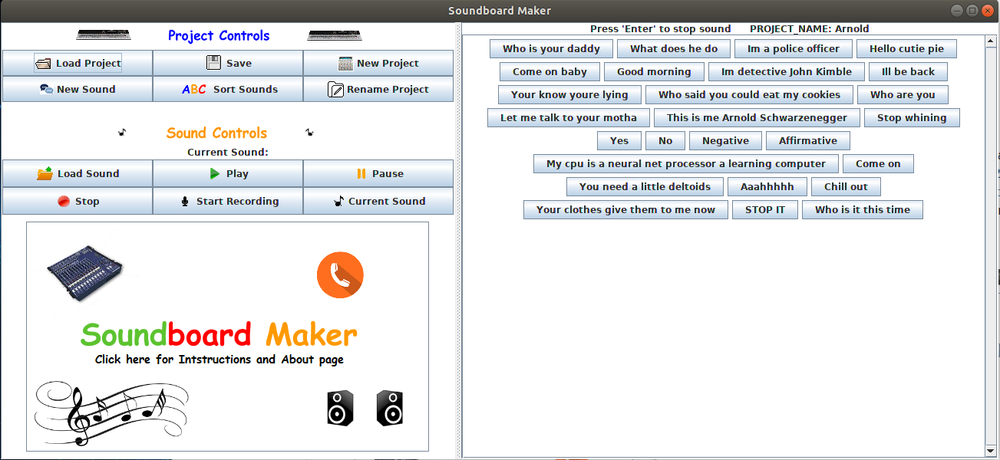

# SoundboardMaker

Requires Java 11. Created by Sean Maxwell, Summer 2014/Nov 2018

 
 

**Overview:**
 
Thanks your for checking out SoundboardMaker. This is a Java desktop application for creating custom soundboards. It was 
my first personal project that I did while still a student in computer science. I initially created this project in the 
summer of 2014 with Java 7. Recently, I updated it to Java 11 4 years after I first created it. This isn't a complex 
full-fledged program meant to be used for actual production. It's just a small project that I used to teach myself Java.
I did not want it to die and I also wanted to play with Java 11, so I decided to revamp it and release it to the world.
Please star this repo if actually find this project useful. 

## Table of Contents

* [Download](#download)
* [Start Program](#start-program)
* [New Project](#new-project)

 

##  Download

To download the program, please go to my website <a href='http://seanpmaxwell.com/projects'>seanpmaxwell.com/projects</a>
and notice the "Linux" and "Windows" buttons near the bottom for the SoundboardMaker. Download the appropriate .jar file 
for your Operating System.  

 

##  Start Program

Once you have the jar downloaded, you'll need to use Java 11 to start it. If Java 11 is your default version go ahead
and start it:

`java -jar Soundboard_Maker.jar`

I developed the project on Linux for which Java 11 was not the default version. If you're on Linux and you don't want
to switch your default version you can download Java 11 and do:

`/usr/lib/jvm/jdk-11/bin/java -jar Soundboard_Maker.jar`
    

##  New Project