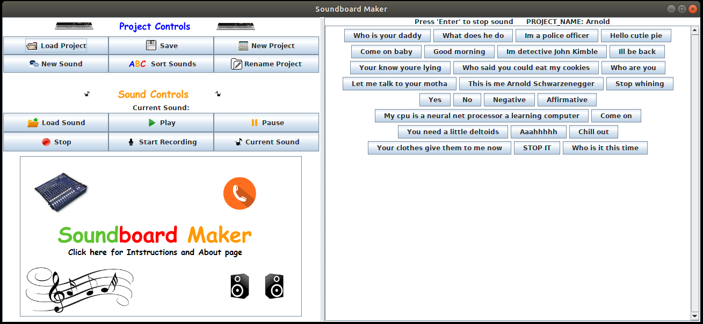
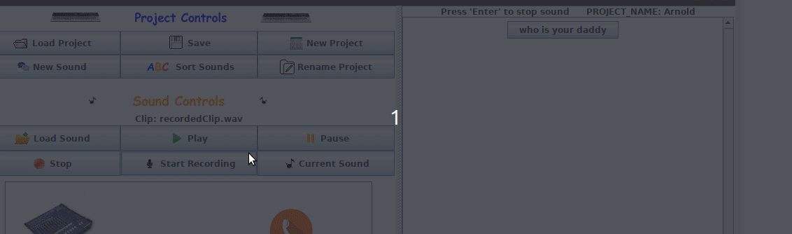

# SoundboardMaker

Requires Java 11. Created by Sean Maxwell, Summer 2014/Nov 2018

 
 

**Overview:**
 
Thanks your for checking out SoundboardMaker. This is a Java desktop application for creating custom soundboards. It was 
my first personal project that I did while still a student in computer science. I initially created this project in the 
summer of 2014 with Java 7. Recently, I updated it to Java 11 4 years after I first created it. This isn't a complex 
full-fledged program meant to be used for actual production. It's just a small project that I used to teach myself Java.
I did not want it to die and I also wanted to play with Java 11, so I decided to revamp it and release it to the world.
Please star this repo if actually find this project useful. 

 

## Table of Contents

* [Download](#download)
* [Start Program](#start-program)
* [New Project](#new-project)
* [Add Sound-Buttons](#add-sounds)
* [Add Sound to Button](#add-sound-to-btn)
* [Upload a Sound](#upload-sound)
* [Delete/Rename Sound](#del-rename)
* [Upload a Sound](#upload-sound)
* [Record a Sound](#record-sound)
* [Save Project](#save-project)
* [Load Project](#load-project)
* [Compiling Source Files](#compiling-source-files)

 

##  Download

To download the program, please go to my website <a href='http://seanpmaxwell.com/projects'>seanpmaxwell.com/projects</a>
and notice the "Linux" and "Windows" buttons near the bottom for the **SoundboardMaker** project. Download the appropriate 
_.jar_ file for your Operating System.  

 

##  Start Program

Once you have the jar downloaded, you'll need to use Java 11 to start it. If Java 11 is your default version go ahead
and start it:

`java -jar SoundboardMaker.jar`

I developed the project on Linux for which Java 11 was not the default version. If you're on Linux and you don't want
to switch your default version you can download Java 11 and do:

`/usr/lib/jvm/jdk-11/bin/java -jar SoundboardMaker.jar`

or on windows:

`C:\wherever you downloaded java11\jdk-11.0.1\bin\java -jar SoundboardMakerWin.jar`
    
 

##  New Project

You don't need to create a new project to start making sounds, but if you want to save your soundboard you need to have
it as part of a project. Don't create a bunch of buttons and then click "New Project". If you click "New Project" 
without saving first, it will erase all your buttons. So the first thing you should do is create a new project and then
add buttons to it. After you click "New Project", you will get a prompt asking you what to name it.

 

##  Add Sound-Buttons

To add sounds to a soundboard, you need to create buttons to hold those sounds. To create a new button/sound, click the
"New Sound" button after creating a new project. You'll be prompted to enter a label, and a new button with the label
will appear on the right side of the window.

 

##  Add sound to a Sound-Button

There a two ways to upload a sound: you can upload a music file from your system or you can record you own sound. Either 
way, the current sound will be stored in the "Current Sound" button. To connect a sound-button on the soundboard display
click and hold the "Current Sound" button, then drag-and-drop the cursor onto the sound-button that you want to play the
currently stored sound. When you click the sound-button, it should now play that sound. You can press enter to stop the
sound from playing.

 

##  Delete/Rename a Sound-Button

If you want to delete or rename a sound-button, right click the button and a menu will dropdown. Select the option that
you want.

 

##  Upload a Sound

If you want to use a sound that you already have on your system, click the "Load Sound" button and select a sound from
your file system. After doing so, if you click "Play", "Pause", or "Stop". You can add the sound to a sound-button by 
dragging-and-dropping the current sound to a sound on the soundboard.

 

##  Record a Sound

To record a sound you need to have a microphone connected to your pc. Click the "Start Recording" button and record 
whatever sound want through your microphone. While recording, the text on the "Start Recording" button will change to 
"Stop Recording". When you are finished, click "Stop Recording". The recorded clip will now be the current sound for the
sound controller. You can click "Play", "Pause", and "Stop" the same as if you had loaded a sound. The new clip will be
recorded as _recordedClip.wav_ under _SoundboardMaker/Clips_. Click-and-drag from "Current Sound" (same as if you loaded
a sound) to a sound-button to assign the recorded clip to a sound-button.

 

##  Save Project

Once you have created a satisfactory amount of sound-buttons, click the "Save" button to save a new project. You'll see
a system file window open and ask you where you want to save the file. Give the project a name and it will be saved with
the file extension _.sdb_ appended to the end of it.

 

##  Load Project

If you've saved a project then started a new project or closed the program, you can reopen a saved project. Click "Load 
Project" and select your previously saved project.

 

##  Compiling Source Files
- Compile src files: `javac -d bin/ src/*.java`
- Create jar file: `jar cvfe SimplePaint.jar Main -C bin .`
- Run the jar file: `java -jar SimplePaint.jar`
