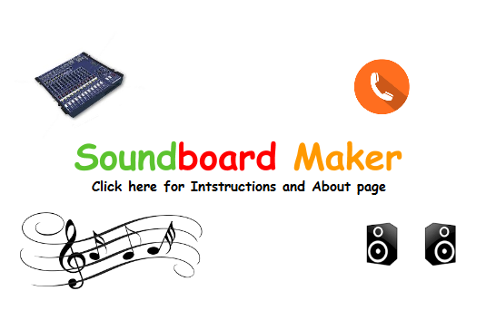

# SoundboardMaker

created by Sean Maxwell 

Thanks your for checking out SoundboardMaker. This is a Java desktop application for creating custom soundboards. It was 
my first personal project that I did while still a student in computer science. I initially created this project in the 
summer of 2014 with Java 7. Recently, I updated it to Java 11 4 years after I first created it. This isn't a complex 
full-fledged program meant to be used for actual production. It's just a small project that I used to teach myself Java.
I did not want it to die and I also wanted to play with Java 11, so I decided to revamp it and release it to the world.
Please star this repo if actually find this project useful. 

## Table of Contents

* [Architecture](#architecture)
* [Get the Repo](#get-repo)
* [Installing the Dev Stack](#installing-dev-stack)
* [Setting up Webstorm](#setting-up-webstorm)
* [Install pgAdmin4](#install-pgAdmin4)
* [Start Services](#start-services)
* [Install Postman](#install-postman)
* [Routes](#routes)
* [Testing](#testing)

 

##  Architecture

 
    

